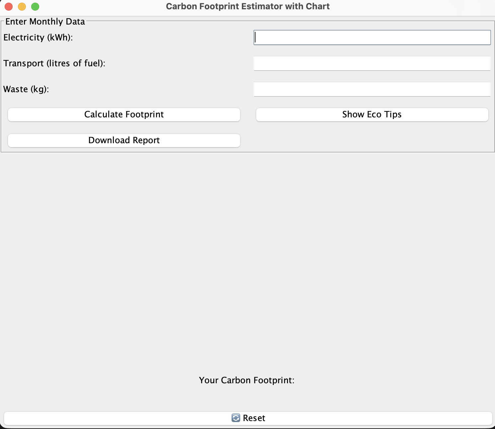
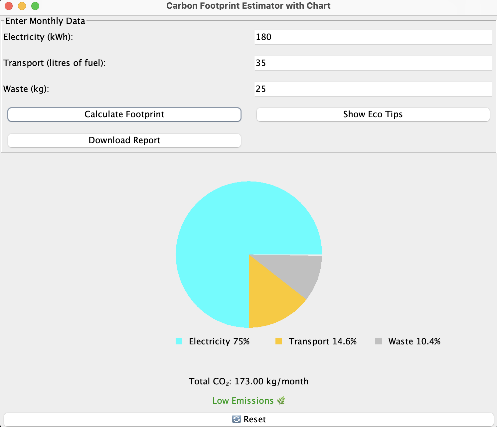
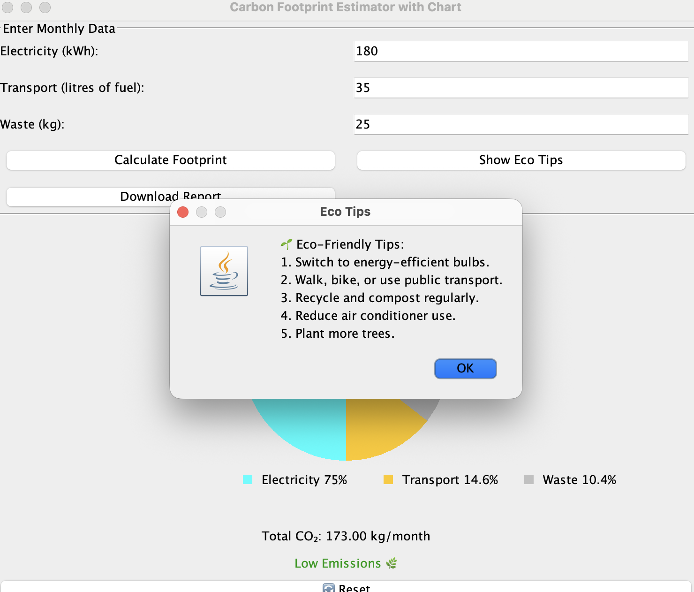
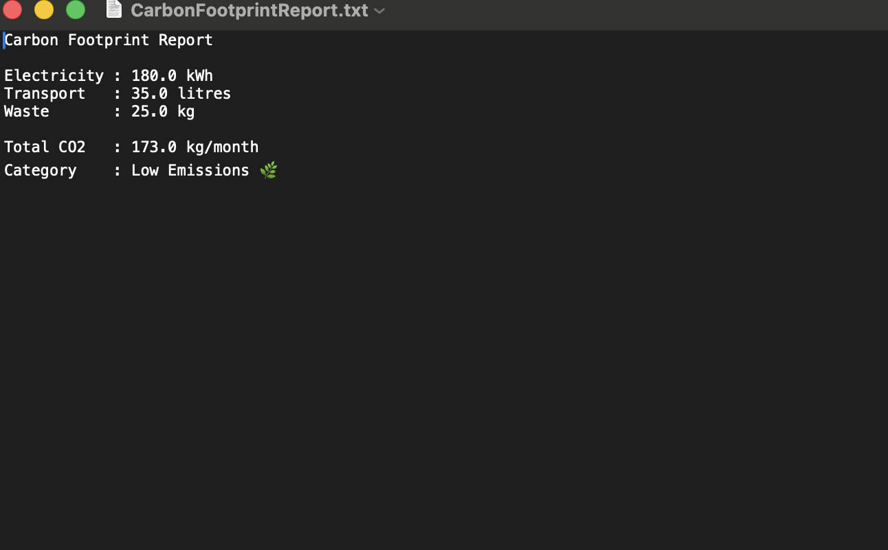

#  Carbon Footprint Calculator

A Java Swing desktop application that estimates monthly carbon emissions based on electricity usage, transportation, and household waste.

## Features

- Interactive Java Swing GUI
- Carbon footprint calculation
- Emission category (Low/Medium/High)
- Color-coded results
- Dynamic pie chart visualization
- Downloadable report
- Input validation
- Eco-friendly tips

## Technologies

- Java
- Swing
- AWT
- File I/O
- Object-Oriented Programming

## Screenshots

## How to Run

1. Clone the repository
2. Open in IntelliJ IDEA
3. Run Main.java